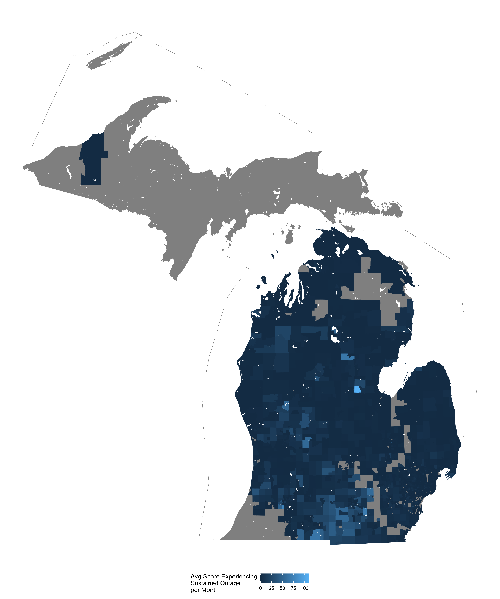

```{r setup, include=FALSE}
options(htmltools.dir.version = FALSE)
library(knitr)
library(kableExtra)
library(magick)
library(webshot)
library(here)
opts_chunk$set(
  fig.align="center",fig.height=4, #fig.width=7,# out.width="748px", #out.length="520.75px",
  dpi=300, 
  cache=T,
  echo=F)


library(tidyverse)
require(cowplot)
require(ggpubr)
require(haven)
require(plot3D)
require(stargazer)
require(quantmod)
require(wbstats)
require(lubridate)
require(gridExtra)
require(scales)
require(broom)
require(gghighlight)
require(xaringan)
require(rmarkdown)
require(pagedown)
require(emo)
options("getSymbols.warning4.0"=FALSE)


library(RefManageR)

BibOptions(check.entries = FALSE, 
           bib.style = "authoryear",
           cite.style = "authoryear",
           style = "markdown",
           hyperlink = TRUE,
           dashed = FALSE)

# Run this once (or to update). MUST have zotero open on this computer (gateway is local)
# unlink(here('zotero.bib'))
# unlink(here('zotero.bib')); download.file('http://127.0.0.1:23119/better-bibtex/export/library?/1/library.bib', destfile = here('zotero.bib'))
myBib <- ReadBib(here('zotero.bib'), check = FALSE)
# Cite with: `r Citet(myBib, c('papkeSimpleRobustTest2022')`
# # Keep Zotero open for keys
# 
imageFolder = file.path('./img')
oldgraphics = texout = imageFolder

```


layout: true


<div class="msu-header"></div> 


```{css, echo = FALSE}
@media print {
  .has-continuation {
    display: block;
  }
}
```

---
class: inverseMSU
# Power Outages...

<br>

```{r, fig.cap='Photo by Justin Kirkpatrick', out.width='100%'}

```
---
class: inverseMSU
# Power Outages...

### Cause expense .font50[`r Citet(myBib, c('andresenUnderstanding2023'))`]
- Food spoilage
- Health impacts
  - Medical equipment
  - Psychological
  - Increase in ER GI admissions following prolonged outage
- Crime

--
- Many of these are worse for vulnerable households
  - Safety (esp. non-English speaking)
  
--

### Are expensive to mitigate
- A 100% reliable grid is astronomically expensive
- Climate change
- Of interest to MPSC

  
---
class: MSU
# Power Outages


.pull-left[
```{r, eval=T, fig.height=600}
include_graphics('https://www.livewireelectricalcharlotte.com/wp-content/uploads/2024/04/Generac-Home-Backup-Generators.jpg')
```
]

.pull-right[
```{r, eval=T, fig.height=600}
include_graphics('https://bakerhomeenergy.com/app/uploads/2023/07/how-home-batteries-work-sonnen-battery.jpeg')
```
]


#### Reliability as a public good
- Reliability is a public good, but can be local
- Undergrounding lines, tree-trimming

#### Private substitutes
- Households purchase private reliability ($2k-$20k)
- Some distribution of preference for reliability

$\rightarrow$ What can we say about the optimal level of grid reliability, and how does it vary with the distribution of preferences for reliability?

---
class: MSU
# Existing Lit

#### "Value of Lost Load"
- Extensive lit, estimates of WTP via averting expenditure, surveys

#### `r Citet(myBib, c('brehmBackup2024'))`
- Lower public reliability lowers electricity costs for all
- As private investment in reliability increases, the optimal public reliability decreases
- `r Citet(myBib, c('eppleEnds1996'))` "The Ends Against The Middle"
  - Public education: low-preference + high-preference coalition to keep spending down
  - A "voting model"


--
#### But
- Brehm et al. assume single measure of reliability (and investment)
  - Different service areas can have different reliability
  - People may sort on unobserved preferences


---
class: MSU
# Questions

#### 1. Are there differences in reliability across income?
- Speaks to incidence of costs, but not necessarily welfare

#### 2. Are there differences in private reliability across income x outages?
- Previous literature: yes
- Poorly identified

--

#### 3. Is there evidence of sorting by reliability?
- If **yes**, optimal public reliability in a service area is very unstable
  - Initial conditions (private investment) is important
- If **no**, optimal reliability for an area is likely the same mean reliability (inclusive of private provision) across all areas.
  - Less add'l public reliability investment should occur when more generators are present
  - Potential twist: Co-adoption of batteries with solar
  
---
class: MSU
# Next

.pull-left[
### New MI data
- Tract-level outages for 10% most impacted tracts from MPSC
  - Monthly reporting (started in 2023) so .font-red[ongoing collection]
- Previously, granular data on outages didn't really exist
  - poweroutage.us is city-level
  - Most papers use poweroutage.us or county-level
]

.pull-right[
```{r, out.width='90%'}

```
]


### Estimate
- Cross-sectional incidence of outages
- Hedonic value of reliability using CoreLogic transaction price

---
class: MSU
# Preliminary Results

```{r, fig.align='center', out.width='75%', fig.cap='Correlation between sustained outages and tract covariates'}
knitr::include_graphics(here('PowerOutages','PowerOutages_Short_insertimage_1.png'))
```


---
class: heading-slide
count: false
exclude: false

Thanks, all!


```{r outputChromePrint, include=F, eval=F}

currentfile = gsub(pattern='\\.Rmd', '', basename(rstudioapi::getSourceEditorContext()$path))
inputpath = 'C:\\Users\\jkirk\\OneDrive - Michigan State University\\Presentations\\NBERDecarb2024\\NBERDecarb2024.html'
# browseURL(inputpath)
pagedown::chrome_print(input = inputpath,
                   output = file.path(dirname(inputpath), paste0(currentfile,'_v1.pdf')),
                   wait = 4,
                   timeout = 1000,
                   format = 'pdf')

# decktape(inputpath,   # Nope. Unless you don't want K's in your latex.
#          file.path(paste0(currentfile, '_v5.pdf')),
#          docker = FALSE) # using docker=TRUE on Mac works, but need to get html written to mac.
#          
#          
hideslide<-function(copydir, destdir){
  all.files = list.files(copydir)
  
}

```
